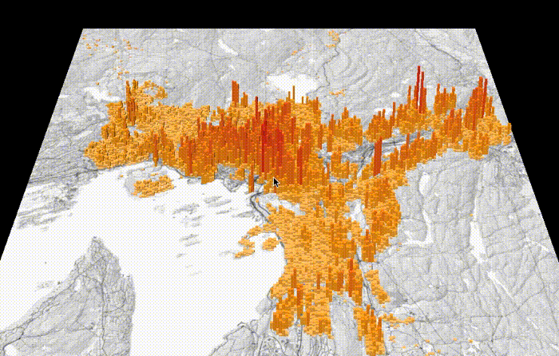
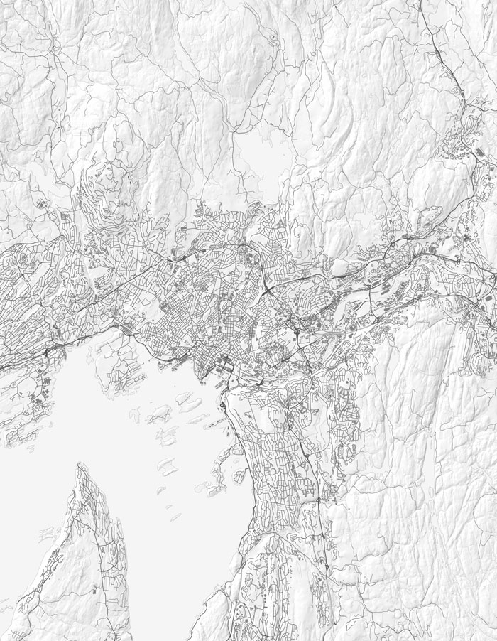
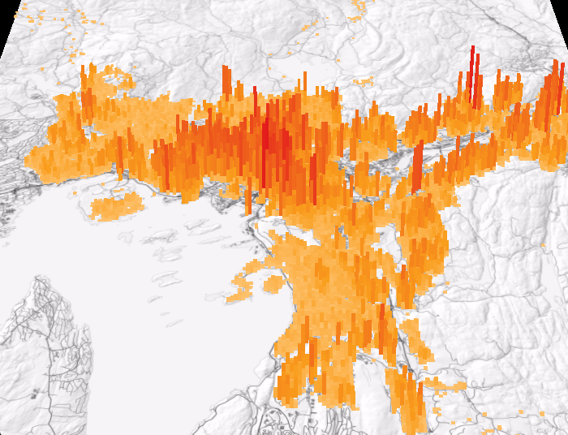

# 3D-visning av statistikk

Laget av <a href="http://mastermaps.com/">Bjørn Sandvik</a>

I <a href="https://github.com/GeoForum/veiledning08">veiledning 8</a> laget vi et interaktivt kart over befolkningen i Oslo kommune. 
Her skal vi vise de samme dataene i 3D med bruk av WebGL og <a href="http://threejs.org/">Three.js</a>. 

[](http://geoforum.github.io/veiledning09/)

I tillegg til fargen angir også høyden hvor mange som bor i hver rute på 100 x 100 meter. 

[Fordeler og ulemper med 3D]

Three.js er et biblioteket som gjør det mye enklere å lage 3D-visualiseringer i nettleseren. Det er ikke laget spesielt for kart, men heldigvis er det lett å konvertere UTM-koordinater til Three.js sitt koordinatsystem. 

### Bakgrunnskart fra Kartverket

Vi skal vise søylene oppå det samme bakgrunnskartet som vi brukte i <a href="https://github.com/GeoForum/veiledning08">den forrige veiledningen</a>, men siden Three.js ikke har støtte for kartfliser (tiles), skan vi laste inn kartet som ett stort bilde. Vi bruker her <a href="http://kartverket.no/Kart/Gratis-kartdata/WMS-tjenester/">WMS-tjensten til Kartverket</a> for å laste ned kartbildet. 
 
Web Map Service (WMS) er en kjent kartstandard som lar deg laste ned kart i ulike projeksjoner og hvor du selv kan bestemme hva som skal vises på kartet (<a href="http://openwms.statkart.no/skwms1/wms.topo2.graatone?SERVICE=WMS&VERSION=1.3.0&REQUEST=GetCapabilities">se oversikt</a>). Det er ikke mulig å laste inn bildet direkte fra Kartverkets server til Three.js, pga. sikkerhetsinnstillingene i nettleseren. I steden lagrer vi en lokal kopi av kartet. 

Vi skal vise befolkningsstatistikk for Oslo kommune, og hvis vi tenker oss en firkant rundt polygonet for Oslo kommune vil denne ha følgende koorinater i UTM 33:

Sørvest: 253700, 6637800
Nordøst: 273800, 6663700

UTM-koordinater er i meter, og dette gir oss et område som er 273 800 - 253 700 = 20 100 meter fra vest til øst, og 6 663 700 - 6 637 800 = 25 900 meter fra nord til sør.  
 
For å hente ut dette kartutsnittet for Oslo kan vi bruke følgende URL: 
 
<a href="http://openwms.statkart.no/skwms1/wms.topo2.graatone?SERVICE=WMS&VERSION=1.3.0&REQUEST=GetMap&CRS=EPSG:32633&BBOX=253700,6637800,273800,6663700&WIDTH=2010&HEIGHT=2590&LAYERS=fjellskygge,N50Vannflate,N50Vannkontur,N50Elver,N50Bilveg,N50Bygningsflate&FORMAT=image/jpeg">http://openwms.statkart.no/skwms1/wms.topo2.graatone?SERVICE=WMS&VERSION=1.3.0&REQUEST=GetMap&CRS=EPSG:32633&BBOX=253700,6637800,273800,6663700&WIDTH=2010&HEIGHT=2590&LAYERS=fjellskygge,N50Vannflate,N50Vannkontur,N50Elver,N50Bilveg,N50Bygningsflate&FORMAT=image/jpeg</a>

Her har vi angitt at kartprojeksjonen ska være UTM 33N (CRS=EPSG:32633), utsnittet er definert av koordinatene over (BBOX=253700,6637800,273800,6663700), oppløsningen skal være 10 meter per pixel (WIDTH=2010, HEIGHT=2590), og vi ønsker å vise følgende kartlag (LAYERS): fjellskygge, vann, elver, bilveg og bygninger. URL'en returnerer dette kartet: 

[](https://github.com/GeoForum/veiledning09/blob/gh-pages/data/wms_oslo_topo2_graatone.jpg)

Vi kan nå sette opp kartet i Three.js. Først definerer vi noen størrelser:

```javascript
var bounds = [253700, 6637800, 273800, 6663700], // UTM 33 vest, sør, øst, nord
    boundsWidth = bounds[2] - bounds[0],
    boundsHeight = bounds[3] - bounds[1],
    sceneWidth = 100,
    sceneHeight = 100 * (boundsHeight / boundsWidth),
    width  = window.innerWidth,
    height = window.innerHeight;
```

"Bounds" er utsnittet i UTM-koordinater som vi omtalt over. "Scene" er bredde og høyde på koordinatsystemet i Three.js. Vi definerer også bredde og høyde på 3D-visningen, som skal dekke hele nettleservinduet. 

```javascript
var scene = new THREE.Scene();

var camera = new THREE.PerspectiveCamera( 20, width / height, 0.1, 1000 );
camera.position.set(0, -200, 120);

var controls = new THREE.TrackballControls(camera);

var renderer = new THREE.WebGLRenderer();
renderer.setSize(width, height);
document.body.appendChild(renderer.domElement);
```

Videre oppretter vi en scene med Three.js hvor vi kan legge til elementer. Vi oppretter også et kamera og angir hvor vi ser på 3D-scenen fra. Vi bruker THREE.TrackballControls som gjør at brukeren selv kan styre kameraet og se på visualiseringen fra ulike vinkler. Til slutt spesifiserer vi at kartet skal tegnes ut med WebGL med bredden og høyden definert over. 

```javascript
var geometry = new THREE.PlaneGeometry(sceneWidth, sceneHeight, 1, 1),
    material = new THREE.MeshBasicMaterial(),
    plane = new THREE.Mesh(geometry, material);

var textureLoader = new THREE.TextureLoader();
textureLoader.load('data/wms_oslo_topo2_graatone.jpg', function(texture) {
    material.map = texture;
    scene.add(plane);
});
```

Selve kartbildet lastes inn ved å først opprette en flate (PlaneGeometry) og legge bildet oppå som en tekstur, før det legges til scenen.

```javascript
function render() {
    controls.update();
    requestAnimationFrame(render);
    renderer.render(scene, camera);
}

render();
```

Vi lager en egen funksjon som tegner ut scenen kontinuerlig ettersom kameravinkelen endrer seg. Vi får nå et <a href="http://geoforum.github.io/veiledning09/kartverket.html">kart i perspektiv</a> som ser slik ut: 

[](http://geoforum.github.io/veiledning09/kartverket.html)

Prøv å endre kameraposisjonen ved å justere verdiene for: camera.position.set(0, -200, 120)

Vi er nå klare for å legge på befolkningsdataene fra SSB: 

```javascript
var cellSize = 100,
    xCells = boundsWidth / cellSize,
    yCells = boundsHeight / cellSize,
    boxSize = sceneWidth / xCells,
    valueFactor = 0.02;
    
var colorScale = d3.scale.linear()
    .domain([0, 100, 617])
    .range(['#fec576', '#f99d1c', '#E31A1C']);

var csv = d3.dsv(' ', 'text/plain');

csv('data/Oslo_bef_100m_2015.csv').get(function(error, data) { // ru250m_2015.csv
    for (var i = 0; i < data.length; i++) {
        var id = data[i].rute_100m,
            utmX = parseInt(id.substring(0, 7)) - 2000000 + cellSize, // First seven digits minus false easting
            utmY = parseInt(id.substring(7, 14)) + cellSize, // Last seven digits
            sceneX = (utmX - bounds[0]) / (boundsWidth / sceneWidth) - sceneWidth / 2,
            sceneY = (utmY - bounds[1]) / (boundsHeight / sceneHeight) - sceneHeight / 2,
            value = parseInt(data[i].sum);

        var geometry = new THREE.BoxGeometry(boxSize, boxSize, value * valueFactor);

        var material = new THREE.MeshBasicMaterial({
            color: color(value)
        });

        var cube = new THREE.Mesh(geometry, material);
        cube.position.set(sceneX, sceneY, value * valueFactor / 2);

        scene.add(cube);
    }
});
```

Vi definerere størrelsen på rutene (cellSize) til 100 meter, og regner ut hvor mye det tilsvarer i koordinatsystemet til Three.js (boxSize). Vi lager også en <a href="https://github.com/mbostock/d3/wiki/Quantitative-Scales#linear-scales">lineær fargeskala med D3.js</a>. Her bruker også D3.js til å lese inn dataene, og for hver rute finner vi x og y UTM-koordinat (<a href="https://github.com/GeoForum/veiledning08#hvordan-lage-et-rutenett">se detaljer i veiledning 8</a>). UTM-koordinatene blir så konvertert verdier som passer med scenen vi har definert over. 
  
Alle ruter får en søyle eller en boks (BoxGeometry) hvor høyden og fargen bestemmes av antall innbyggere. Søylen plasseres på riktig sted, og legges til scenen vår. 
  

  
  


